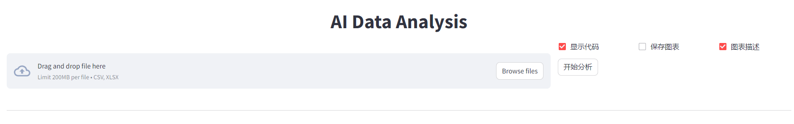
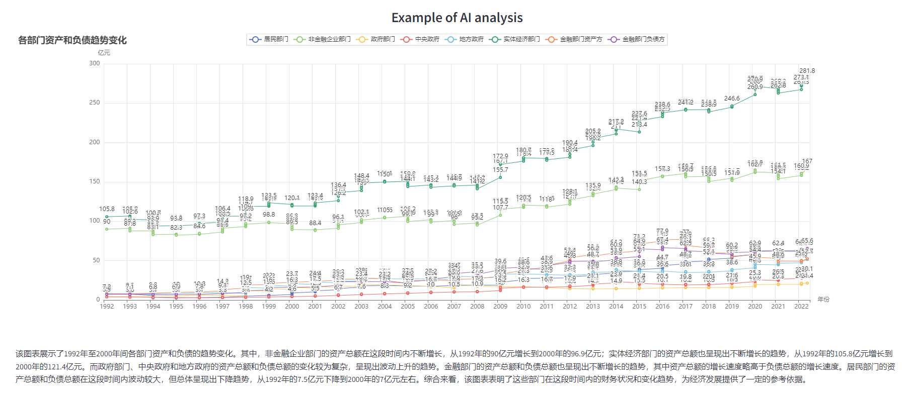
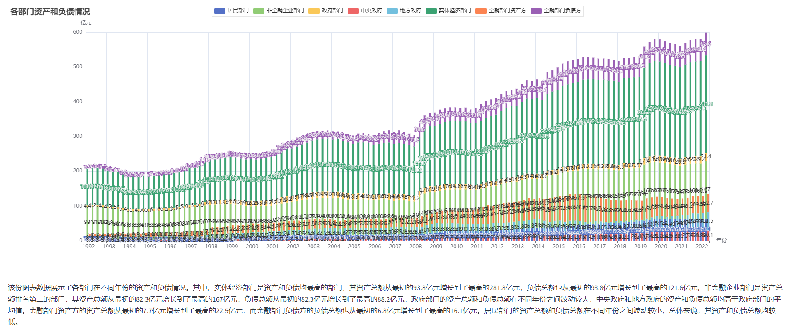
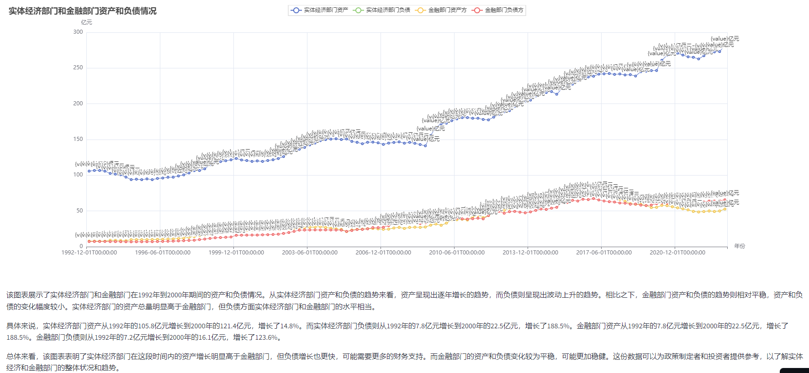
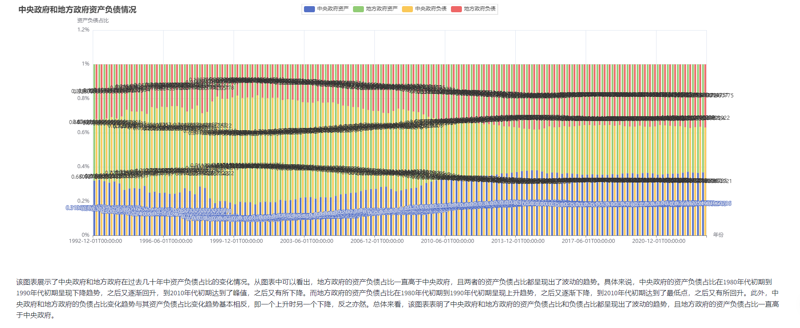

# AI 全自动数据分析

点击进行试用：
[AIDataAnalysis](https://autoreport.streamlit.app/)

任何上传一个csv或xlsx文件，即可进行完全自动化地数据分析工作，该数据分析全流程均由AI自主探索完成，得到的数据分析结果并非都是简单的统计性分析结果，经测试，AI全给出一些有趣的分析方向和图表绘制方法。

使用时，上传文件，并勾选是否需要显示代码和进行图表描述。
这里用到的是使用pyechart生成图表，共代码可以复制到本地进行自己的优化和修改图表样式，以生成更符合自己的图表

## 数据分析示例

由于作者工作原因，目前项目还不完善
TODO:
1.增加生成代码的运行兼容性
2.补充更多图表样式的处理逻辑

